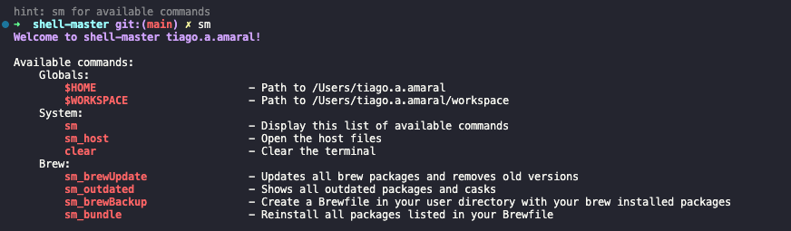

# shell-master
A customizable toolkit of shell scripts, aliases, and configurations to automate and streamline your development environment.



```shell
# Display this list of available commands
shell-master

# Alias for shell-master
sm
```

# MY_COMMANDS getting start

```shell
# Open the file .zshrc
code $HOME/.zshrc

# Add this line to the end of .zshrc
export SHELLMASTER="absolute/path/to/shell-master" # export SHELLMASTER="$HOME/shell-master"
source "$HOME/workspace/shell-master/my_commands_zshrc.sh"

# Open the file .zprofile
code $HOME/.zprofile

# Add this line to the end of .zprofile
export SHELLMASTER="absolute/path/to/shell-master" # export SHELLMASTER="$HOME/shell-master"
source "$HOME/workspace/shell-master/my_commands_zprofile.sh"
```

# Homebrew Bundle
```shell
# The command brew dump creates a Brewfile listing all installed Homebrew packages and casks. This file allows for easy backup and replication of your environment. Use brew bundle to restore your setup from the Brewfile:
brew bundle dump

# Use this command to reinstall all packages listed in your Brewfile (Would be the "npm i"):
brew bundle

# Shows all outdated packages and casks:
brew outdated

# Updates all packages and removes old versions
brew update && brew upgrade && brew cleanup
```

Learn more about: https://tomlankhorst.nl/brew-bundle-restore-backup